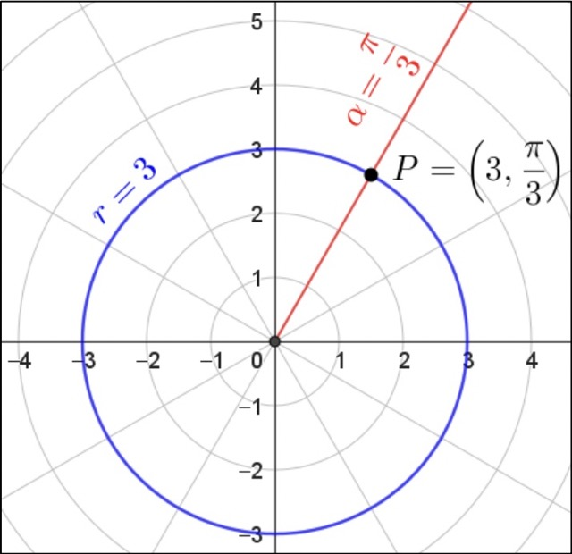

---
tags:
  - linear-algebra
lang:
  - en
---

## Points and [[Vectors]]

[[Vectors]] can be built using points' coordinates. Given two points $A, B$ in $\mathbb{R}^3$, the vector $\vec{AB}$ can be built like so:

$$\vec{AB} = \begin{bmatrix}
B_{x} - A_{x} \\
B_{y} - A_{y} \\
B_{z} - A_{z} \\
\end{bmatrix}$$

To find the coordinates of point $C$, opposite of $B$ in symmetry to $A$, one can add vectors to points to reach the point's coordinates. Example:

$$C = A - \vec{AB}$$

The distance from $A$ to $B$ is the [[Vectors#Module|module]] of $\vec{AB}$.

## Coordinates

### Polar 

Polar coordinates are defined using a radius $r$ and an angle $\alpha$. The point is the intersection between the [[Lines|line]] traced from the origin with angle $\alpha$ and the circle of radius $r$.

### Cartesian

I don't think I have to explain these...

### Conversion

Polar to cartesian:

$$(r, \alpha) \implies (r \cdot \cos \alpha, r \cdot \sin \alpha)$$

Cartesian to polar:

$$(x, y) \implies ( \sqrt{ x^2 + y^2 }, \pm \cos^{-1} \frac{x}{r} )$$

### [[🔎]] Examples

Having $\vec{x} = \begin{bmatrix} 3 \\ 1 \end{bmatrix}$:

$$\begin{align}
||\vec{x}|| &= \sqrt{ 3^2 + 1^2 } = \sqrt{ 10 } \\
\frac{1}{\sqrt{ 10 }} \cdot \vec{x} &= \begin{bmatrix}
\frac{3}{\sqrt{ 10 }} \\
\frac{1}{\sqrt{ 10 }}
\end{bmatrix} \implies \sqrt{ 0.9 + 0.1 } = 1
\end{align}$$

---

Having a vector $\vec{v}$ with module $||\vec{v}|| = \sqrt{ 10 }$, change the module to be $k=7$ maintaining its direction:

[[🛠️]] The problem can be resolved using a versor:

$$\left( \frac{1}{||\vec{v}||} \cdot k\right) \cdot \vec{v}$$

## Secant

The secant is defined as the line that bisects the angle between two [[Vectors|vectors]].

If both vectors have equal [[Vectors#Module|module]], then the secant is defined as the [[Vectors#Sum|sum]] of the vectors. 

Otherwise, a [[Vectors#Versor|versor]] that satisfies $||\vec{v}|| = ||\vec{u}||$ needs to be used:

$$k \cdot \vec{v} = \vec{x} : ||\vec{x}|| = ||\vec{u}||$$

## Projection

### Vector on vector

The projection [[Vectors|vector]] is the only vector that is orthogonal to the projection base and touches the endpoint of the vector you want to project:

$$(\vec{b} - k\vec{a}) \cdot \vec{a} = 0$$

where $k$ is:

$$k = \frac{\vec{b} \cdot \vec{a}}{\vec{a} \cdot \vec{a}}$$

defining the projection of $\vec{b}$ onto $\vec{a}$, being $b'$, as a [[Vectors#Linear Combination|LC]] of $\vec{a}$:

$$pro(\vec{b}, \vec{a}) = \frac{\vec{b} \cdot \vec{a}}{\vec{a} \cdot \vec{a}} \cdot \vec{a}$$

### Point on vector

Having three points $A,B,P$ and a vector $\vec{AB}$ as the base, $\vec{AH}$ is the [[#Vector on vector|vectorial projection]] of $\vec{AP}$ onto $\vec{AB}$ such that $A + \vec{AH} = H$.

Now $\vec{AB}$ being $\vec{a}$ and $\vec{AP}$ being $\vec{b}$:

The vector starting from $P$ and ending at $H$ is defined as:

$$\vec{PH} = pro(\vec{b}, \vec{a}) - \vec{b}$$

The distance from the **origin point** to the projected point is:

$$||ka|| = ||\vec{b}|| \cdot \cos \alpha$$

> in [[physics.index|physics]] this is the $x$ component

The [[Vectors#Module|module]] of $\vec{PH}$ can also be defined as:

$$||\vec{PH}|| = ||\vec{b}|| \cdot \sin \alpha= \frac{|\vec{b} \times \vec{a}|}{||\vec{a}||}$$

> in 2D the output vector of the cross product is interpreted as a scalar so the absolute value notation is more appropriate. In 3D it is $||\vec{b} \times \vec{a}||$.

> this module is actually derived from the vector parallel to $\vec{PH}$

> in [[physics.index|physics]] this is the $y$ component

## Cross Product in Vectorial Geometry

The [[Vectors#Cross Product|Cross Product]] has a variety of uses in vectorial geometry.

### Area of parallelogram

The [[Vectors#Module|module]] of the result vector of the cross product returns the area of the parallelogram defined by the two operands.

### Quick algo. to build an orthogonal vector

$$\begin{bmatrix}
x_{1} \\
x_{2} \\
x_{3}
\end{bmatrix}
=
\begin{bmatrix}
x_{2}x_{3} \\
x_{1}x_{3} \\
-2x_{1}x_{2}
\end{bmatrix}$$

### Build a vector orthogonal to a plane $\mathbb{R}^3$

The result of the [[Vectors#Cross Product|Cross Product]] operation is a vector orthogonal to the plane generated by the two operands.

### Cross Product Theorem

The theorem is defined as:

$$||\vec{u} \times \vec{v}|| = ||\vec{u}|| \cdot ||\vec{v}|| \cdot \sin \alpha$$

defining $\sin \alpha$ as:

$$\sin \alpha = \frac{||\vec{u} \times \vec{v}||}{||\vec{u}|| \cdot ||\vec{v}||}$$

$\sin \alpha$ is the [[Vectors#Module|module]] of the [[#Point on vector|projection vector]] defining the height of the triangle generated by the two operands.

### Uses in $\mathbb{R}^2$

[[👁️]] this operation can also be performed in $\mathbb{R}^2$. In this space, the vector returned by the cross product is treated like a scalar value since the result will be:

$$\begin{bmatrix}
0 \\
0 \\
x
\end{bmatrix}$$

> in this case use $|\vec{v}|$ instead of $||\vec{v}||$ since it's more appropriate for the scalar context.

Similar to $\mathbb{R}^3$, $x$ (basically being the [[Vectors#Module|module]] of the result vector of the cross product) is the area of the parallelogram defined by the two operands and also provides the orientation (sign) of that of the two vectors in relation to each other. This can be interpreted as the orientation of the points used to create the vectors:

- if $x > 0 \text{ or } A > 0 \implies$ anti-clockwise
- if $x < 0 \text{ or } A < 0 \implies$ clockwise
- if $x = 0 \text{ or } A = 0 \implies$ the point is on the vector / vectors are [[Vectors#Dependency|LD]].

## Triple Product in Vectorial Geometry

The [[Vectors#Triple Product|Triple Product]] has a variety of uses in vectorial geometry.

### Volume

The triple product is used to calculate the **volume** of the parallelepiped defined by $\vec{a}, \vec{b}, \vec{c}$.

### Are 3 vectors LI?

Given three vectors, check if they are [[Vectors#Dependency|LI]].

If the [[Vectors#Triple Product|Triple Product]] returns `0` they are **not** linearly dependent, otherwise they are.

### DX or SX Ternary?

If the [[Vectors#Triple Product|Triple Product]] is $> 0$ it is **DX**.
If the [[Vectors#Triple Product|Triple Product]] is $< 0$ it is **SX**.

### Find $H$ projection of $P$  onto plane $ABC$ in $\mathbb{R}^3$

H = P + PH
where PH = KA = -AK where K is the projection of P onto (AB cross AC)

height parallelepiped = abs(AB cross AC dot AP) / norm(AB cross AC)

points counter-clockwise -> triple prod > 0
points clockwise -> triple prod < 0

Ese complanarita:
- are three points aligned? cross prod = 0 -> yes, cross prod != 0 -> no
- given three points, find a fourth that is on the same plane: A + kAB + kAC
- find CL to get null vec -> eq system with kAB_x+jAC_x+hAD_x=0 ...
- prove that these four points are complanari -> triple product = 0 aka AB cross AC dot AD

Distanze
dist P da A: sqrt(vecAP dot vecAP)
...
CHECK SLIDES!!!!!!!!!!
## Ortho-normal Ternary

It is defined as 3 [[Vectors]] all orthogonal to each other and all with [[Vectors#Versor|module]] `1`.

