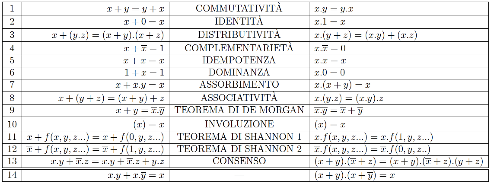

---
tags:
  - digitec
lang: en
---

## Minterms

**Unique** `AND` combinations of all available variables that return `TRUE`. Variables appear exactly once, in true form for `TRUE`s and negated (complemented) form for `FALSE`s.

## Maxterms

Maxterms are exactly the opposite of [[#Minterms]]. **Unique** `OR` combinations of all available variables that return `FALSE`. Variables appear exactly once, in true form for `FALSE`s and negated (complemented) form for `TRUE`s.

## SOP Form

Sum Of Products. Pick only the [[#Minterms]] that give a `true` $Y$.

$$
Y = \sum_{}^{}mi_{i}
$$

Example:

$$
Y = F(A,B) = \overline{A}B + AB = \sum_{}^{}(1,3)
$$

## POS Form

Product of Sums. Pick only the [[#Maxterms]] that give a `false` $Y$.

$$
Y = \prod_{}^{}MI_{i}
$$

Example:

$$
Y = F(A,B) = (A+B)(\overline{A}+B) = \prod_{}^{}(0,3)
$$

## Axioms

> [[🚨]] **Shannon 1**: if $x$ inside $f$ is $\overline{x}$, then it becomes $\overline{0}$ which is $1$
